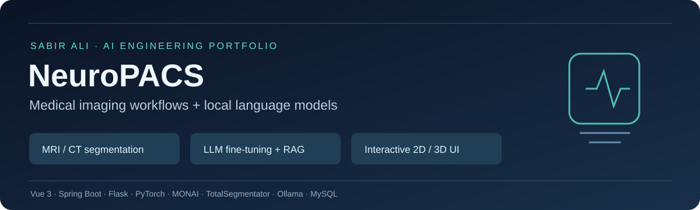
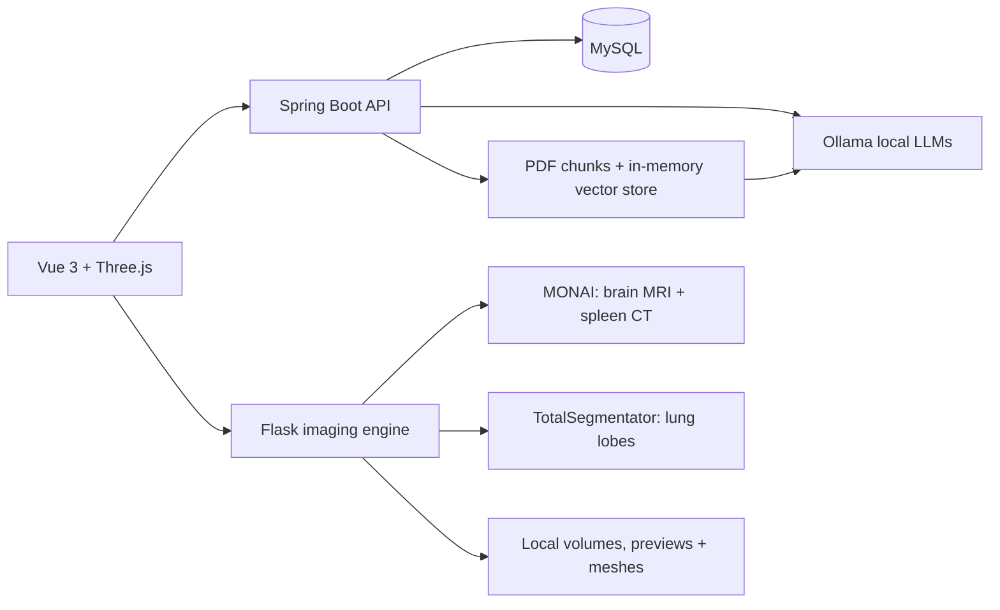

# NeuroPACS — Medical Imaging & Local AI Platform

**Independently built by [Sabir Ali](https://github.com/hakrosabir) during an AI Engineer internship at Neusoft.**

A full-stack prototype that connects patient appointments and reporting with MRI/CT segmentation, interactive medical-image viewers, and local AI assistants. The engineering focus is turning model inference into an accessible application workflow: upload a volume, track processing, inspect slices and meshes, and connect results to a patient report.

**For reviewers:** [Case study](docs/CASE_STUDY.md) · [Architecture & code walkthrough](docs/ARCHITECTURE.md) · [Model card](docs/MODEL_CARD.md) · [Setup](docs/SETUP.md) · [API guide](docs/API.md)

[Recorded project walkthrough](https://youtu.be/B7_dxOoNZW0) — retained from the original project page; it documents an earlier demonstration rather than a fresh runtime validation.

## What this project demonstrates

| Area | Implementation | Evidence |
| --- | --- | --- |
| Medical-image inference | MONAI BraTS MRI and spleen CT pipelines; TotalSegmentator lung-lobe inference with GPU-to-CPU fallback | [Python engine](neusoft-python-backend/app.py), [brain runner](neusoft-python-backend/services/monai_runner.py), [spleen runner](neusoft-python-backend/spleen_services/inference.py) |
| LLM fine-tuning | Llama 3.1 8B workflow using Unsloth, 4-bit loading, LoRA, supervised fine-tuning, and GGUF export | [Training notebook](neusoft-fine-tuned-RAG-model/fine_tuning.ipynb), [Ollama Modelfile](neusoft-fine-tuned-RAG-model/Modelfile) |
| Retrieval-augmented generation | PDF ingestion, token splitting, embeddings, and similarity retrieval through Spring AI | [DoctorRagService](neusoft-spring-boot-backend/src/main/java/com/neusoft/neusoft_project/service/DoctorRagService.java) |
| Patient-context assistant | Database records injected into local-model prompts; `SHOW_REPORT` response mapped to a UI action | [ChatController](neusoft-spring-boot-backend/src/main/java/com/neusoft/neusoft_project/controller/ChatController.java), [PatientChatbot](neusoft-project-frontend/src/components/PatientChatbot.vue) |
| Imaging visualization | Multiplanar previews, CT windowing, marching-cubes meshes, Three.js GLB/PLY viewers | [Preview generation](neusoft-python-backend/services/preview.py), [mesh generation](neusoft-python-backend/services/mesh.py), [MeshViewer](neusoft-project-frontend/src/components/MeshViewer.vue) |
| Application integration | Patient, doctor, nurse/technician, and admin dashboards; appointments, reports, account approval, and logs | [Frontend routes](neusoft-project-frontend/src/router/index.js), [Java controllers](neusoft-spring-boot-backend/src/main/java/com/neusoft/neusoft_project/controller) |

The segmentation models are pretrained third-party models. My contribution is the application, integration, inference orchestration, visualization, reporting workflow, and the separate LLM fine-tuning work.

## Architecture



The browser calls Java for records and AI chat, and Python for most imaging operations. Java also contains a Python upload bridge. This snapshot uses local file storage; it does not implement a DICOM network archive.

## Technology stack

| Layer | Technologies |
| --- | --- |
| Frontend | Vue 3.5, Vue Router, Vite 7, Axios, Three.js, html2pdf.js |
| Core API | Java 21, Spring Boot 3.4.12, MyBatis Plus, MySQL, BCrypt |
| Imaging | Python, Flask, PyTorch, MONAI, TotalSegmentator, SimpleITK, NiBabel, pydicom, scikit-image, trimesh |
| Local AI | Ollama, Spring AI 1.0.0-M5, `mistral`, `mxbai-embed-large`, optional custom `neusoft-ai` |
| Training | Unsloth, Hugging Face datasets, TRL SFTTrainer, LoRA, GGUF |

## Repository guide

```text
neusoft-project-frontend/     Dashboards, chat components, 2D/3D viewers
neusoft-spring-boot-backend/   REST APIs, records, PDF RAG, local AI integration
neusoft-python-backend/       Imaging APIs, inference wrappers, previews, meshes
neusoft-mysql-database/       Schema only; no exported account or patient records
neusoft-fine-tuned-RAG-model/ Training notebook and Ollama model configuration
docs/                        Architecture, setup, model card, case study, limitations
scripts/                     Static portfolio checks (do not start services)
```

## Reviewing without running

Start with the [case study](docs/CASE_STUDY.md), then follow the linked source files above. No application launch is needed to review the implementation. The [setup guide](docs/SETUP.md) is available for a future local demonstration.

The repository includes source and a clean database schema. Patient scans, database exports, generated reports, model weights, notebook outputs, and local credentials are excluded. The custom `Neusoft_PACS.gguf` artifact is **not included**, so custom-model reproduction requires a separately supplied export. MONAI weights must also be obtained separately.

## Status and next engineering steps

This is an internship portfolio prototype. Runtime behavior has not been revalidated during portfolio preparation. The source shows the implemented workflows, but does not establish clinical accuracy, deployment readiness, or measured latency.

- Replace placeholder login tokens and permissive API access with verified authentication and authorization.
- Isolate document retrieval and chat history by authenticated user.
- Add durable job storage and avoid shared BraTS datalist writes across concurrent cases.
- Validate MRI channel ordering, label mapping, mesh orientation, and preview alignment against reference outputs.
- Establish held-out LLM evaluations and project-specific segmentation benchmarks.

See [known limitations](docs/LIMITATIONS.md) for the detailed assessment. The CT page retains historical “Spleen / ICH” naming; its implemented model segments **spleen**, and does not demonstrate intracranial-hemorrhage detection.

## Author and attribution

**Sabir Ali — AI Engineer internship project**  
[GitHub](https://github.com/hakrosabir) · [LinkedIn](https://www.linkedin.com/in/sabirhakro/)

Third-party models and libraries retain their own terms; see [attributions](THIRD_PARTY_NOTICES.md). This repository does not grant an additional open-source license for the original application code.
