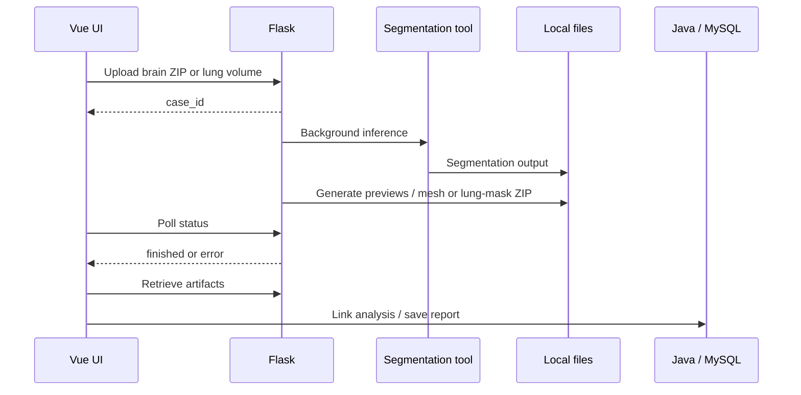

# Architecture and reviewer walkthrough

## Service boundaries

| Service | Default address | Responsibility |
| --- | --- | --- |
| Vue / Vite | `http://localhost:5173` | Dashboards, viewers, chat, report editing |
| Spring Boot | `http://localhost:8081` | Accounts, appointments, reports, record context, PDF RAG |
| Flask | `http://localhost:5000` | Volumes, segmentation, previews, meshes |
| Ollama | `http://localhost:11434` | Chat and embedding models |
| MySQL | `localhost:3306` | Application records |

The frontend talks directly to both APIs. `MedicalImageService` additionally implements a Java-to-Python upload bridge. There is no message broker, reverse proxy, object store, or DICOM networking archive in this source snapshot.

## Imaging flow

Brain inputs require T1, T1ce, T2, and FLAIR files detected from filenames. Lung inputs accept NIfTI, NRRD, or a DICOM ZIP. Spleen CT accepts one NIfTI, directly or in a ZIP, and runs synchronously. See [limitations](LIMITATIONS.md) for channel-order and label-mapping concerns.

## Two AI paths

**Patient assistant:** `PatientDataService` retrieves database records and formats selected textual fields. `ChatController` combines them with instructions and conversation history, calls Ollama's generation API, and returns `reply`, `action`, and `actionId`. `SHOW_REPORT:<id>` becomes a frontend report action. This is structured record-context injection, rather than vector retrieval.

**Doctor PDF assistant:** `DoctorRagService` uses `PagePdfDocumentReader`, a `TokenTextSplitter` with a 400-token default chunk size, embeddings, and `QuestionAnswerAdvisor`. Retrieval requests four chunks with a similarity threshold of 0.5. `RagConfiguration` supplies a shared in-memory `SimpleVectorStore`; documents are not durable or isolated by doctor.

Fine-tuning is an offline notebook workflow. It does not build the PDF vector store. Patient and doctor models have separate settings.

## Data model

The seven tables are `users`, `doctor_profiles`, `patient_profiles`, `appointments`, `brain_analysis`, `medical_report`, and `system_logs`. [schema.sql](../neusoft-mysql-database/schema.sql) contains the authoritative definitions, with no data rows.

Users connect to profile tables through foreign keys. Appointments carry patient/doctor IDs and scan status. Reports are unique by appointment and store text plus optional image snapshots. Brain records connect case IDs to patient IDs. Several relationships are application-level references without foreign-key enforcement.

## Code-reading order

1. [Frontend router](../neusoft-project-frontend/src/router/index.js): map the workflow.
2. [Python app](../neusoft-python-backend/app.py): inspect uploads, jobs, inference, and downloads.
3. [BraTS runner](../neusoft-python-backend/services/monai_runner.py) and [spleen runner](../neusoft-python-backend/spleen_services/inference.py): inspect bundle invocation.
4. [Mesh generation](../neusoft-python-backend/services/mesh.py) and [viewer](../neusoft-project-frontend/src/components/MeshViewer.vue): follow volume-to-surface visualization.
5. [Patient context](../neusoft-spring-boot-backend/src/main/java/com/neusoft/neusoft_project/service/PatientDataService.java) and [chat controller](../neusoft-spring-boot-backend/src/main/java/com/neusoft/neusoft_project/controller/ChatController.java): follow grounding and UI actions.
6. [PDF RAG](../neusoft-spring-boot-backend/src/main/java/com/neusoft/neusoft_project/service/DoctorRagService.java): inspect retrieval.
7. [Training notebook](../neusoft-fine-tuned-RAG-model/fine_tuning.ipynb): review model adaptation.

## Configuration

Frontend URLs are centralized in `src/config.js` with Vite overrides. Java reads database and model settings from environment placeholders. Python reads paths and launch settings from the process environment. Example files contain public defaults and no database password.
